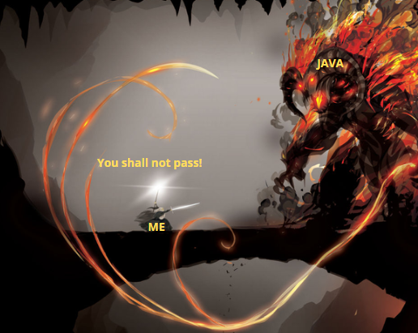

# Dev comments

Esse documento foi criado para registrar progresso, não do desenvolvimento, mas do desenvolvedor.

Meu objetivo principal era assumir que sou um completo ignorante em matéria de "BACK-END" e tentar construir esse projeto do completo.

Não pode apelar para um GPT ou seus forks.
O motivo disso não é arrogância ou negação da utilidade da ferramenta, mas sim o reconhecimento da importância que os fundamentos tem e como projetar softwares 

Esse projeto na verdade é um desafio criado pelo [Rafael Coelho](https://racoelho.com.br/listas/desafios/sistema-de-reservas-de-restaurante), mas não para por aí, pois eu só descobri isso assistindo um vídeo da [Fernanda Kipper](https://www.youtube.com/watch?v=AD0FbOR4Zj8), recomendado pelo Youtube enquanto eu assistia outro vídeo do [Fábio Akita](). Então aqui já fica meu agradecimento para eles por produzirem conteúdo com excelência. Se no final você tiver curtido esse nosso delírio coletivo (sim, você faz parte disso agora), considere apoiá-los nas redes e afins.

1. Comecei escolhendo a linguagem que vou utilizar. ERRADO!
2. Vai ser Java. MAIS ERRADO AINDA!

Para começar cada projeto, é necessário primeiro pensar no padrão de arquitetura de software que vai ser utilizado. Antes de escrever uma linha de código, o primeiro passo de qualquer projeto sólido é decidir a arquitetura, pois ela define as regras do jogo. Vejamos um exemplo juntos:

Imagine que você precisa construir uma casa. O ideal é primeiro desenhar uma planta, definer se terá um ou dois andares, quais cômodos, onde ficarão os encanamentos e a fiação. Tu não chega simplesmente jogando massa no chão e levantando uma parede de tijolos.

Na engenharia de software é o mesmo raciocínio. No dia a dia, bons programadores possuem experiência suficiente para identificar a arquitetura mais adequada, mas como eu posso ler os requisitos e identificar qual padrão usar? Perceber as limitações dessa arquitetura e etc. Saber escolher a arquitetura correta a partir dos requisitos envolve um processo de análise crítica do que o sistema exige agora e do que ele pode exigir no futuro. Isso é experiência pura e você precisa viver isso.
Uma forma de vivermos coisas desse tipo através de nossa imaginação são livros. Não sou nenhum sênior para dizer que leituras são relevantes ou não e nem estou fazendo propaganda ou drop shipping. Estou descrevendo a MINHA EXPERIÊNCIA com esse universo infinito da programação. Eu consultei a seguinte bibliografia:

1. Pragmatic Programmer
2. Clean Architecture
3. Patterns of Enterprise Application Architecture
4. Software Architecture: The Hard Parts
5. Domain-Driven Design

Dá uma estudada nessas fontes, faça seus testes, tire suas conclusões.

A partir daqui, considero que você consegue decidir a planta dessa estrutura que deseja criar, eu decidi a minha.

- API RESTful
- 3 entidades: usuários, mesas e reservas
- Lógica simples de CRUD
- Autenticação
- Desenvolvimento individual

Vou usar MVC modular com separação por domínio. Se por algum acaso eu quiser expandir e adicionar regras de maior complexidade, talvez tenhamos uma outra conversa, sobre como migrar isso para uma Clean Architecture ou DDD.

A imagem pode ilustrar o padrão arquitetural MVC no contexto de aplicações web.

1. Client
- Função: Representa o navegador ou aplicativo do usuário final.
- Atuação: Envia requisições HTTP (por exemplo, ao acessar uma URL ou clicar em um botão).
- Destino da requisição: Vai direto para o Controller.

2. Controller
- Função: O cérebro da aplicação. Recebe e interpreta todas as requisições do cliente.
- Responsabilidades:
  - Recebe a requisição do cliente.
  - Decide o que fazer com base no tipo de requisição (por exemplo, buscar dados, salvar, deletar).
  - Chama o Model se precisar de dados ou lógica de negócio.
  - Chama a View para montar a resposta que será enviada ao cliente.
  - Setas bidirecionais com Model e View: O Controller é quem orquestra as comunicações entre eles.

3. Model
- Função: A camada de regra de negócio e acesso a dados.
- Responsabilidades:
  - Executar regras de negócio (por exemplo, cálculos, validações).
  - Acessar a base de dados para obter, inserir, atualizar ou deletar informações.
  - Conexão com o banco de dados (laranja): O Model é o único que interage diretamente com o banco.

4. View
- Função: A interface com o usuário. Responsável por exibir os dados.
- Responsabilidades:
  - Apresentar as informações processadas pelo Controller.
  - Pode usar formatos como HTML, XML, JSON (como indicado na imagem).
  - Não tem lógica de negócio, apenas exibição.

5. Database
- Função: Armazena os dados da aplicação.
- Acesso indireto: Apenas o Model acessa o banco diretamente — isso é fundamental no padrão MVC para manter a separação de responsabilidades.

Algo que temos uma arquitetura para seguir, a ideia seria escolher a linguagem que vamos utilizar como ferramenta. Não será Java!

Para esse desafio vou usar aquele cujo nome não deve ser pronunciado, já que uso no meu trabalho atualmente, porém não com esse tipo de profundidade que vamos explorar aqui.

<b>Obs.:</b> Java é igual um meteoro, só é bonito quando vemos passar bem distante de nossa posição geográfica.